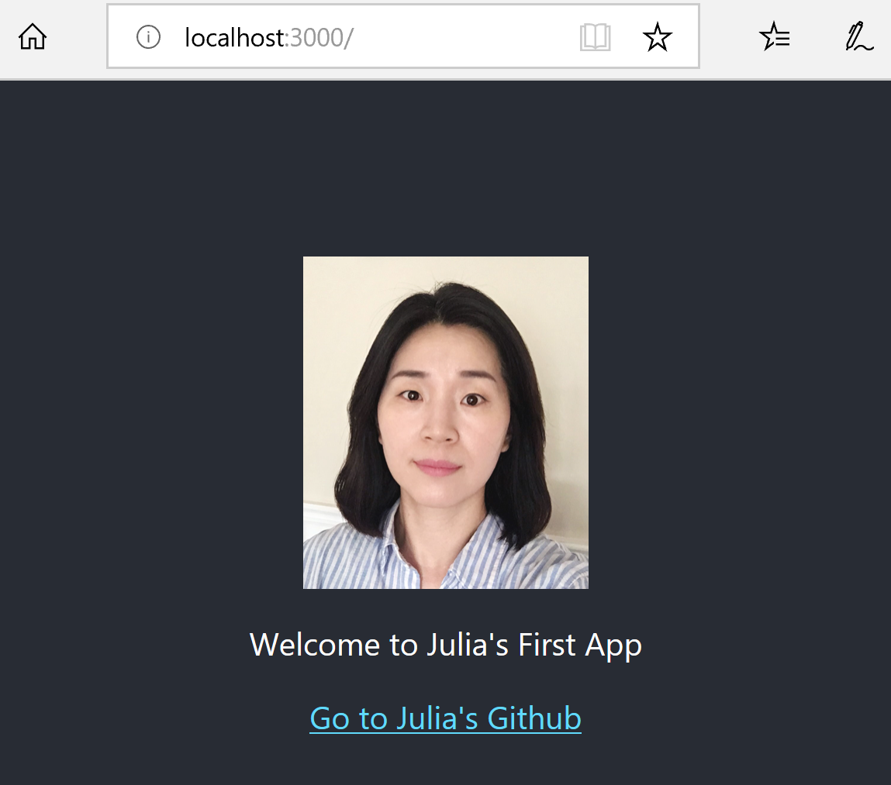

# Create React App  

@ npm v 6.4.1

@ node v10.15.2

Link to <a href='https://facebook.github.io/create-react-app/docs/getting-started'> Tutorial </a>

-> Create React App is an officially supported way to create single-page React applications. 

-> It offers a modern build setup with no configuration.

1. Before getting start, need to install Git and NPM(Node) 

2. install create-react-app

        npm install -g create-react-app

3. create new app named my-first-app
       
        npx create-react-app my-first-app
        cd my-first-app
        npm start

4. After successfully created the app, can see many folders in my-first-app project folder

        my-first-app
        ├── README.md
        ├── node_modules
        ├── package.json
        ├── .gitignore
        ├── public
        │   ├── favicon.ico
        │   ├── index.html
        │   └── manifest.json
        └── src
            ├── App.css
            ├── App.js
            ├── App.test.js
            ├── index.css
            ├── index.js
            ├── logo.svg
            └── serviceWorker.js
 
 5. public/index.html
 
       the default page
 
 6. src/index.js
 
       this file is the JavaScript entry point 
       
       need to import React and ReactDom
       
       And import other component to render 
       
         import React from 'react';
         import ReactDOM from 'react-dom';
         import App from './App';
   
 7. src/App.js
       
       the react page using ES6
       
       need to export with a name like App to use from other js files
       
        export default App;
       
 8. package.json
 
       json file for setting the app like app name, version, dependencies, available scripts
 
  
 9. Open http://localhost:3000 in the browser to see running the app
 
 View the Simple App with an image and text 
 
  
